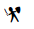

<!-- README.md is generated from README.Rmd. Please edit that file -->

```{r, include = FALSE}
knitr::opts_chunk$set(
  collapse = TRUE,
  comment = "#>",
  fig.path = "man/figures/",
  out.width = "100%"
)
devtools::load_all()
```

# gameicons

<!-- badges: start -->
<!-- badges: end -->

This package adds a single function to use icons from [game-icons.net](https://game-icons.net/) in shiny applications or RMD files that are rendered to html. Most of these icons are licensed under [CC BY 3.0](https://creativecommons.org/licenses/by/3.0/). See the pages for the individual icons to see who you should credit. The font files are taken from [seiyria/gameicons-font](https://github.com/seiyria/gameicons-font/).

## Installation

``` r
devtools::install_github('oganm/gameicons')
```

## Usage

```r
game_icon('swordman')
```


You can list available icons with `list_icons`. This function needs the `stringr` package which is only included in `Enchances` so it won't be installed automatically on pakcage installation.
